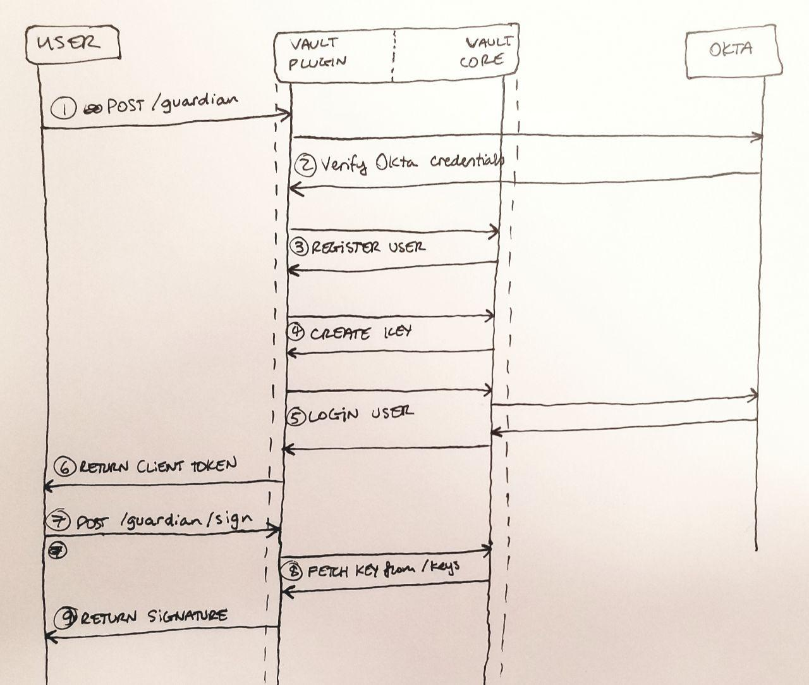

# okta-vault
Software req'd to configure and use a Vault keystore behind Okta auth.  This is an integrated, batteries-included, authentication+authorization service for one `secp256k1` private key.

> Under Construction: More details pending as docs are compiled

- Principles:
	- Keep fxnality minimal so it can slide into as many places as possible
	- Provide a clean API for consuming clients
	- Just focus on keeping keys safe and letting users sign (maybe verify?) with them

- Found Issues:
	- Vault open-source version only supports their built-in Okta Verify MFA, not Google etc.

- Open Questions:
	- A: Plugin manages a user's key and lets them sign.
	- Q: What does plugin need to connect with?
		- A: Make it an HTTPS microservice, slides into all platforms (mobile/desktop might need PopupRedirect solution)
	- Q: What do the first three user types look like?
		- A: Key variables: Funding? Technical Proficiency?  Individual or Organization?
		- A: Two end-users: person who sets up service, person who signs with it
		- A: Includes random people at hackathons who are just trying to make crypto apps.
		- A: At least also support Google, as Okta is an enterprise solution.
	- A: One instance, many users
	- A: What are the first applications that are going to use this?
		- Probably gonna be the wallet app so people don't need to directly load their private keys
	- Q: Support multiple keys?  Maybe key regeneration?
		- A: Nope, just one key.  See if the namespacing can allow for getting diff one without modifying first one

- Security Concerns:
	- Make sure to use HTTPS so attackers can't snoop the payload on its way to Vault
	- Make sure the session is one-time-use so an open session can't be re-used by an attacker

## Open Questions
- Okta users must be explicitly registered to the Vault, separate from the login step.  Suppose we have the plugin call this register step -- the registration is just based on username.  How do we ensure they're not lying about the Okta username?  Not a real security issue if they can't login with that username, but could allow denial of service to the username's rightful owner.
- Is the whole Plugin system fast enough (without being built into the vault binary) to handle every single request related to this? One benefit to a sign-up only plugin is that only "new user signup" requests would need to hit the plugin, and then the plugin would just dump secrets and credentials that the user would use (possibly through an app on a server we control) via other built-in engines

## One Plugin Strategy
One angle here is to create a single plugin which handles everything: registering users, creating keys, and signing with them.  

### Network Protocol
A first time user's flow would look like:

<<<<<<< HEAD

=======

>>>>>>> 2c867bb05fc0046b922c124d2c1f812913198ef1

1. User POSTs to the Vault plugin at `/guardian`, an unauthenticated endpoint, including their Okta username & password in the body.
2. Plugin GETs the user from the Okta API at [`/api/v1/users/:username`](https://developer.okta.com/docs/api/resources/users#get-user-with-login), verifying they really exist in our installation.
3. Plugin registers user with core Vault by POSTing to [`/auth/okta/users/:username`](https://www.vaultproject.io/api/auth/okta/index.html#register-user).  They are automatically given the `guardianUser` policy which gives them access to the `/guardian/sign` endpoint.
4. Plugin creates a key for the user by POSTing to core Vault at [`/secret/:username`](https://www.vaultproject.io/api/secret/kv/kv-v1.html#create-update-secret).  Stores the mnemonic, HD_PATH, and raw file, just good measure.
5. Plugin uses the earlier credentials to perform a login on behalf of the user, POSTing to core Vault at [`/auth/okta/login/:username`](https://www.vaultproject.io/api/auth/okta/index.html#login).  Core Vault handles checking those credentials against the Okta servers.
6. Plugin returns the [client token](https://www.vaultproject.io/api/auth/okta/index.html#sample-response-5) to the user so they can make a sign call.
7. User POSTs to the Vault plugin at `/guardian/sign`, an authenticated endpoint, including their data to sign in the body.
8. Plugin fetches key by GETing [`/secret/:username`](https://www.vaultproject.io/api/secret/kv/kv-v1.html#read-secret), unmarshalls it, and uses it with the provided data to produce a signature.
9. Plugin returns signature to user, key is never exposed.

### Policy Design
In this strategy, there are only two policies required.  One privileged Guardian policy which the plugin can use itself, and a regular Enduser policy which all registered user accounts will be given.

- Guardian Policy
  - `/auth/okta/users/*: ['read','create']`
  - `/auth/okta/login: [create]`
  - `/secrets: ['read','create']`
- Enduser Policy
  - `/guardian/sign: ['create']`

The lack of `'update'` permissions means the privileged policy will never overwrite anybody's keys.  They do not need to create new policies -- the sign path does not require a user argument, so the same policy can be given to all future users.

## Regular Signing User Story

0 - From within a mobile, desktop, or web application, the user clicks a button to sign a transaction.

1. Application builds the transaction object for later.

---- plugin work begins

2. Open a redirect popup to request Okta authentication from Vault, a la Google auth

3. Uses Okta auth token to make a request to the `vault-signer` plugin on the Vault server
  
    3a. If multi-user, userId determines the signing key

4. Signed transaction blob is returned to client

---- plugin work ends

5. Send signed transaction to one of our tx-executors

## Initial Setup User Story

(Assumption: Company-managed key service)

1. User goes to simple page to setup their managed key
2. Login with Okta (or Google?)
3. Service checks with Vault to determine whether user already has key
	3a. If key present, allow user to export key or seed
	3b. If no key, create a key within the Vault and show the mnemonic to the user

## Enterprise Wishlist
This documents ideas about features or strategies that we could incorporate if we use Vault Enterprise.  Those clusters are very expensive, though, so ideally we find workarounds such that we don't need these:

- **EGP**: Endpoint Governing Policies let you create a policy on an endpoint itself, such as `/sys/policies`, rather than putting a policy onto a token.  These policies are also much more dynamic, allowing for things like checking that requests come from specific CIDR ranges. 
- **MFA**: Vault OSS supports Okta Verify Push, but no other forms of MFA.  It seems like an enterprise installation might give us a more full-featured Okta integration, such that the `login` method can include a one-time password out of something like Google Authenticator.
